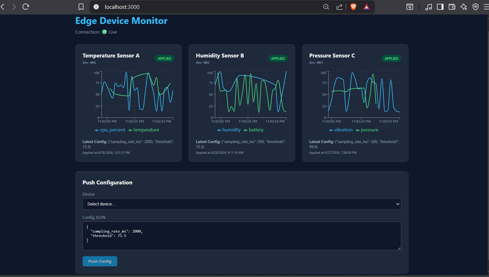

# Edge Device Monitor

A production-ready FastAPI + React stack for monitoring edge devices with live telemetry streaming and cloud-to-device configuration management.

## Quick Start

### Prerequisites
- Python 3.11+
- Node.js 20+
- (Optional) Docker & Docker Compose

### 1. Backend

```bash
cd backend
python -m venv venv
source venv/bin/activate  # Windows: venv\Scripts\activate
pip install -r requirements.txt
uvicorn app.main:app --reload
```

API runs at http://localhost:8000  
Auto-seeds 3 devices on first start.

### 2. Frontend

```bash
cd frontend
npm install
npm run dev
```

Dashboard runs at http://localhost:3000

### 3. Simulator

```bash
cd simulator
pip install -r requirements.txt
python simulator.py
```

Starts 3 simulated devices that stream telemetry every 2s and auto-ack config pushes.

### Docker (optional)

```bash
docker-compose up --build
```

## Design Choices

1. **Async-First Stack**: SQLAlchemy 2.0 with `aiosqlite` and FastAPI async endpoints ensure the server never blocks on DB I/O or WebSocket handling, allowing thousands of concurrent device connections on a single process.

2. **Unified WebSocket Channel**: A single `/ws` endpoint multiplexes frontend and device traffic by client type. This reduces infrastructure complexity (one route, one load-balancer rule) while keeping concerns separated in code.

3. **Config State Machine**: Config pushes are persisted with states `pending → applied/failed`. Devices ack via WebSocket; if offline, the config queues and applies on reconnect. Frontends receive real-time state updates so you can visualize the full round-trip.

4. **SQLite for Portability, Postgres-Ready**: The default `aiosqlite` setup requires zero infrastructure, but switching to `asyncpg` is a one-line `DATABASE_URL` change—no code changes needed.

5. **React + Recharts + Vite**: Vite provides instant HMR for rapid development. Recharts renders time-series without heavy dependencies. The custom `useWebSocket` hook handles auto-reconnect and ping/pong for production resilience.


### Scaling Path to 1M+ Devices

| Bottleneck              | Current                            | At Scale                                                                             |
| ----------------------- | ---------------------------------- | ------------------------------------------------------------------------------------ |
| **Database**            | SQLite (file-based, single writer) | PostgreSQL + TimescaleDB for time-series writes; read replicas for dashboard queries |
| **Broadcast**           | In-process `ConnectionManager`     | Redis Pub/Sub for cross-server WebSocket fan-out                                     |
| **Backend**             | Single FastAPI process             | Load-balanced pool with sticky sessions per device                                   |
| **Telemetry ingestion** | Direct DB commit                   | Kafka/RabbitMQ buffer between devices and backend to absorb write spikes             |


### Known Limitations

1. **SQLite single-writer lock**: At >100 concurrent devices, writes queue. Switch to PostgreSQL for production.

2. **No device auth**: Any client can connect as any device_id. Add JWT or mTLS for production.

3. **In-memory state**: ConnectionManager lives in one process. Multiple backend servers need Redis for cross-server broadcast.

4. **No telemetry retention policy**: SQLite grows unbounded. Add a cron job or TimescaleDB compression for old data.


## Demo



https://github.com/user-attachments/assets/db1aced5-73df-4857-bab0-06fb6fcdbfbf


